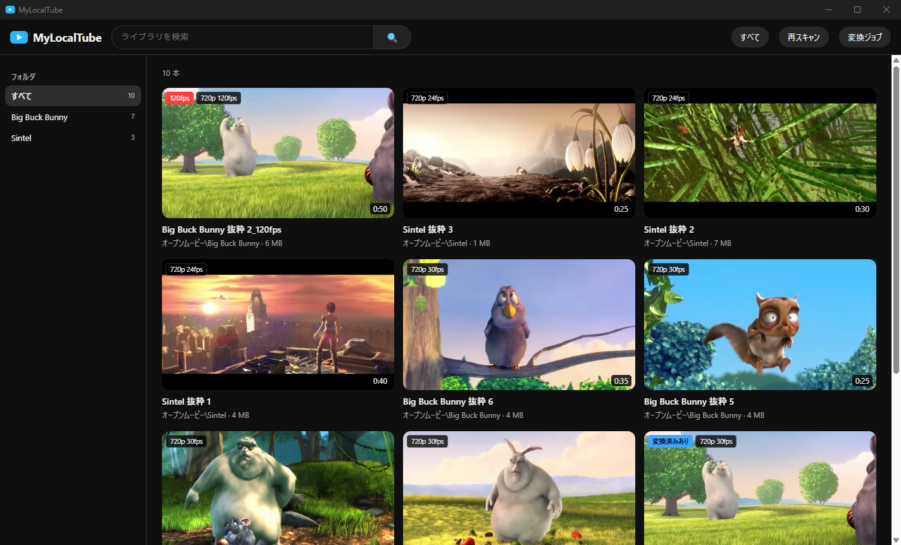
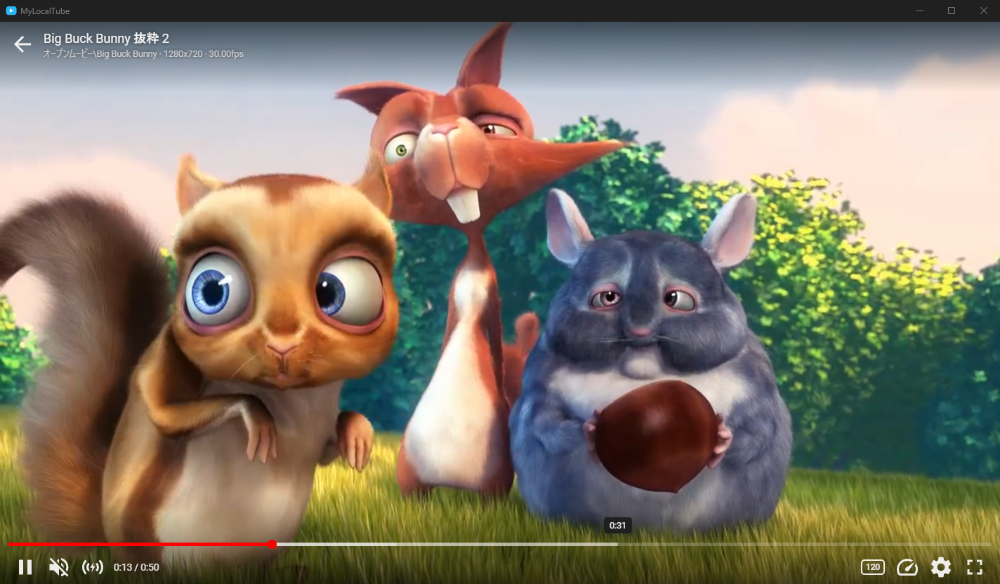
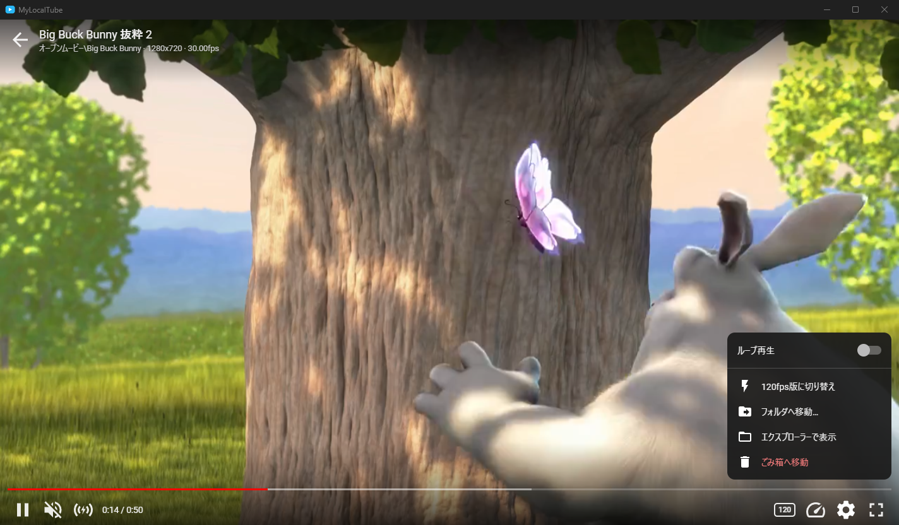
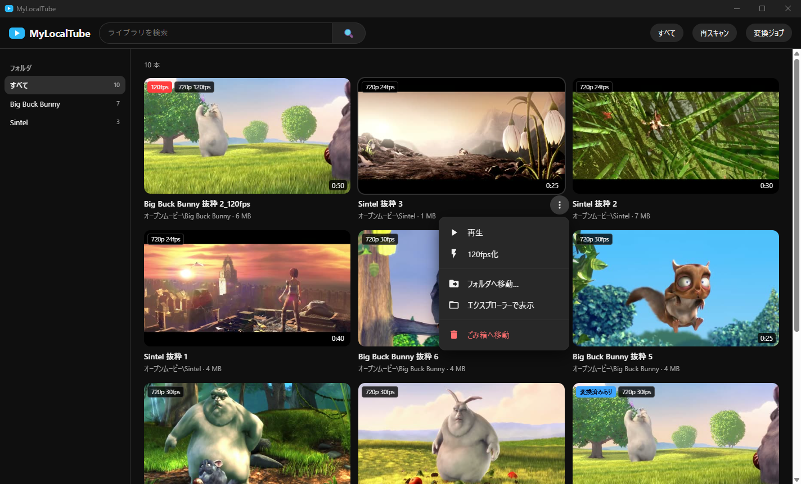
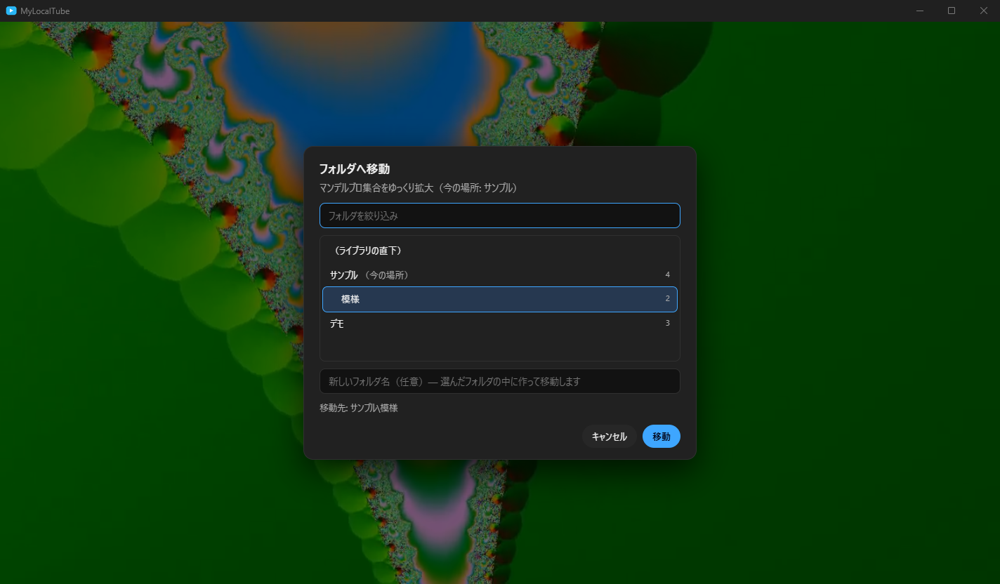

<p align="center"></p>

# MyLocalTube

[](https://github.com/keigoly/local-tube-player/stargazers)
[](LICENSE)


手元の動画フォルダを **YouTube 風の画面で再生できる** Windows 向けのデスクトップアプリです。
動画ファイルは移動もコピーもせず、フォルダを索引するだけです。「既定のアプリ」にすれば、エクスプローラーでダブルクリックした動画もこのアプリで開けます。

A Windows desktop app that plays your local video folders in a YouTube-like UI (no copying, just indexing).

<p align="center"></p>

| 再生画面（カーソルを乗せると操作バーを表示） | ⚙ 設定メニュー |
|---|---|
|  |  |
| **⋮ メニュー（カード右下の ⋮、または右クリックで開く）** | **フォルダへ移動** |
|  |  |

<sub>写真の映像は、Blender Foundation のオープンムービー（Big Buck Bunny・Sintel、CC BY 3.0）から切り出したものです。クレジットは下の「ライセンス」にあります。写真は `docs/make_screenshots.py` で撮り直せます。</sub>

## できること

- **一覧**: 動画フォルダをサムネイル付きで表示。フォルダ別の絞り込みと検索ができます
- **YouTube 風の操作バー**: 動画に重ねて表示し、カーソルを止めると隠れます
  - 赤いシークバー（カーソルを乗せた位置の時刻を表示・ドラッグで移動）/ 音量 / 全画面 / 左上の「←」で一覧に戻る
  - **音量ブースト**: クリックで 200%。ボタンの上でホイールを回すと 150〜400% に調整できます
  - **再生速度**: ボタンの上のホイールで 0.25 刻み、Shift+ホイールで 0.05 刻み。クリックで標準の速さに戻ります
  - キー操作は YouTube と同じです（下の表）
- **ウィンドウの大きさ合わせ**: ウィンドウが動画の縦横比に合わせて変わるので、上下・左右に黒帯が出ません
- **ファイル操作（⋮ メニュー / ⚙ 設定）**: 別のフォルダへ移動（新しいフォルダも作れます）・ごみ箱へ移動（ごみ箱から元に戻せます）・エクスプローラーで表示
- **既定のアプリ**: .mp4 / .m4v / .mkv / .webm / .mov をこのアプリで開けます。アプリを開いているときに別の動画を開くと、同じウィンドウで切り替わります
- **再生できない動画は出さない**: MPEG-2 映像の .ts など、再生できない形式は一覧に表示しません
- **120fps 変換（任意）**: 外部の変換ツールを設定すると、「120」ボタンから変換したり、元の動画と 120fps 版を切り替えたりできます

## 動作環境

- Windows 10 / 11（64bit）と WebView2 ランタイム（Windows 11 には最初から入っています）
- Python 3.11 以上
- ffmpeg（`ffmpeg.exe`。PATH を通すか、`config_local.py` で場所を指定します）

## セットアップ

```bat
git clone https://github.com/keigoly/local-tube-player.git
cd local-tube-player
python -m venv .venv
.venv\Scripts\python -m pip install -r requirements.txt

rem 動画フォルダの場所などを設定（config_local.py は git 管理外）
copy config_local.example.py config_local.py
notepad config_local.py

rem 起動用の MyLocalTube.exe とアイコンを作る（.NET Framework 4 付属の C# コンパイラを使う）
launcher\build.cmd
```

`MyLocalTube.exe` をダブルクリックすると起動します（ショートカットを作って、デスクトップやスタートメニューに置くと便利です）。
初回の起動では、設定した動画フォルダ（`config_local.py` の `LIBRARY_ROOTS`）を走査します。あとから増えた動画は、右上の「再スキャン」で一覧に反映できます。
ブラウザで使いたい場合は `start.cmd` を実行してください（http://127.0.0.1:5560 が開きます）。

### 既定のアプリにする

```bat
.venv\Scripts\python launcher\file_assoc.py register
```

コマンドを実行すると Windows の「既定のアプリ」の設定画面が開くので、MyLocalTube を選んでください（Windows の仕様で、この最後の選択だけはアプリからできません）。
`status` で今の既定のアプリを確認でき、`unregister` で登録を消せます。.ts は登録しません（MPEG-2 映像は再生できないため）。

## キー操作

| キー | 動作 |
|---|---|
| Space / k | 再生 / 一時停止 |
| ← / → | 5 秒戻る / 進む |
| j / l | 10 秒戻る / 進む |
| ↑ / ↓ | 音量を 5% 上げる / 下げる |
| m | ミュートの切り替え |
| f / ダブルクリック | 全画面の切り替え |
| 0〜9 | 動画の 0%〜90% の位置へ移動 |
| , / . | 一時停止中に 1 コマ戻る / 進む |
| < / > | 再生速度を下げる / 上げる |
| Esc | 全画面を抜ける / 一覧に戻る |

## 120fps 変換ツールの仕様（任意）

変換ツールはこのリポジトリに含まれていません。次の約束を満たすスクリプトを `config_local.py` の `CONVERTER_PY` に指定すると、
「120」ボタンと変換ジョブが使えるようになります（指定しなければ、関係する画面は表示されません）。

- `<CONVERTER_PYTHON> <CONVERTER_PY> <入力動画のパス>` の形で実行されます（カレントディレクトリはスクリプトのあるフォルダです）
- 入力と同じフォルダに `<名前>_120fps<拡張子>` を作ってください。すでにある場合は、何もせずに終了してかまいません
- 進捗は tqdm 形式で標準出力に出してください。`[1/2] 名前: 45%|...| 30/62` や `[2/3] 名前: 45%|` の形を読み取って、画面に表示します
- 取り消したときやアプリを終了したときは、プロセスツリーごと止められます（作りかけの出力はアプリ側で消します）
- 任意: `[シーン検出] …` `[補間倍率] …` `[作業フォルダ] …` で始まる行は、注記として画面に表示します。
  `スキップ:` で始まる行は「出力がすでにあった」、`[エラー]` `[AI Error Log]` `[エンコードエラー]` で始まる行はエラーの注記として扱います
- 変換の作業フォルダをライブラリの中に作る場合は、`config_local.py` の `EXCLUDE_DIR_NAMES` / `EXCLUDE_DIR_PREFIXES` で走査の対象から外してください
- `CONVERTER_MIN_PER_MIN`（動画 1 分あたり何分かかるか）を指定すると、変換前の確認に、かかる時間の目安を表示します

## 構成

| ファイル | 役割 |
|---|---|
| `desktop.py` | アプリ版の本体。サーバを別スレッドで起動し、WebView2 のウィンドウに表示 |
| `app.py` | FastAPI サーバ。Range リクエスト対応の配信・mkv などの詰め替え配信・API・進捗の SSE |
| `library.py` | 走査・索引（SQLite）・コーデック判定・サムネイル作成 |
| `fileops.py` | 移動・ごみ箱・エクスプローラーで表示 |
| `jobs.py` | 120fps 変換ジョブの順番待ち（キュー） |
| `osdeps.py` | OS ごとに違う処理の窓口。Windows では `platform_win.py`、それ以外では `platform_mac.py` を使う |
| `platform_win.py` | Windows 用の処理（二重起動の防止・ダイアログ・ウィンドウの位置と大きさ・ごみ箱・エクスプローラーで表示・変換の停止） |
| `platform_mac.py` | macOS 用の処理（準備中。今は呼ばれたことをログに残すだけの仮の実装） |
| `config.py` / `config_local.example.py` | 設定の既定値 / 自分用の設定のひな形 |
| `static/index.html` | 画面（ビルド不要の単一 HTML） |
| `launcher/` | 起動用 exe のソース（C#）・アイコンの生成・既定のアプリへの登録 |
| `data/` | 索引 DB・サムネイル・ログ（自動で作られます。git 管理外） |

設計の経緯・実装の要点・これまでに直した不具合は、`DEVELOPMENT.md` にまとめています。

## 制限

- 今は Windows 専用です（macOS 版を予定しています）
- mkv などは再生時に MP4 へ詰め替えながら配信するため、シークできません
- ファイルの移動は、同じドライブの中だけです

## ライセンス

MIT ライセンスです（`LICENSE`）。YouTube は Google LLC の商標です。本プロジェクトは YouTube / Google とは関係ありません。

README の画面写真に写っている映像のクレジットです（対象は写真だけで、コードには関係しません）:

- *Big Buck Bunny* — (c) copyright 2008, Blender Foundation / [www.bigbuckbunny.org](https://peach.blender.org/) — [CC BY 3.0](https://creativecommons.org/licenses/by/3.0/)
- *Sintel* — (c) copyright Blender Foundation / [durian.blender.org](https://durian.blender.org/) — [CC BY 3.0](https://creativecommons.org/licenses/by/3.0/)

写真では映像の一部を切り出し、1280x720 に縮小して余白を足しています。
